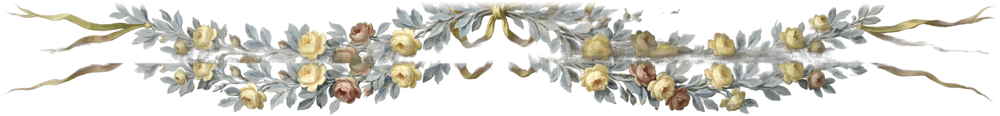

<div align="center">
  
</div>

<h1 align="center">Hi 👋, I'm Ayoub Elattar</h1>
<h3 align="center">Forward-Deployed Engineer · Full-Stack + UI/UX Design</h3>

<p align="center">
I embed with a team, learn their domain fast, and build the product end to end, from agentic AI backends to the UX people open every day. Design and frontend are my strongest skills, so teams trust me with the whole product, not just the model behind it.
</p>

<p align="center">📍 Taipei, Taiwan &nbsp;·&nbsp; 🌐 <a href="https://elattar.dev">elattar.dev</a></p>

<div align="center">
  
</div>

```javascript
class Ayoub {
  constructor() {
    this.name = 'Ayoub Elattar';
    this.role = 'Forward-Deployed Engineer';
    this.work = ['Full-Stack Engineering', 'AI / LLM Agents', 'UI/UX Design'];
    this.stack = ['TypeScript', 'Python', 'React', 'Next.js', 'LangGraph'];
    this.ships = 'the whole product, end to end';
    this.languages = ['English', 'Arabic', '中文', '日本語'];
  }
}
```

##  Frontend &amp; Design

<p align="left">
<a href="https://developer.mozilla.org/en-US/docs/Web/JavaScript" title="JavaScript"></a>
<a href="https://www.typescriptlang.org/" title="TypeScript"></a>
<a href="https://react.dev/" title="React"></a>
<a href="https://nextjs.org/" title="Next.js"></a>
<a href="https://vuejs.org/" title="Vue"></a>
<a href="https://nuxt.com/" title="Nuxt"></a>
<a href="https://flutter.dev/" title="Flutter"></a>
<a href="https://sass-lang.com/" title="Sass"></a>
<a href="https://tailwindcss.com/" title="Tailwind CSS"></a>
<a href="https://www.figma.com/" title="Figma"></a>
</p>

##  Backend, AI &amp; Tools

<p align="left">
<a href="https://www.python.org/" title="Python"></a>
<a href="https://nodejs.org/" title="Node.js"></a>
<a href="https://www.postgresql.org/" title="PostgreSQL"></a>
<a href="https://graphql.org/" title="GraphQL"></a>
<a href="https://www.docker.com/" title="Docker"></a>
<a href="https://firebase.google.com/" title="Firebase"></a>
<a href="https://www.cypress.io/" title="Cypress"></a>
<a href="https://git-scm.com/" title="Git"></a>
<a href="https://www.linux.org/" title="Linux"></a>
</p>

##  Stats

<!-- STATS:START -->
| Language | Share |
| --- | --- |
| TypeScript | 67.5% |
| Python | 12.0% |
| CSS | 7.3% |
| JavaScript | 6.8% |
| Jupyter Notebook | 1.8% |
| HTML | 1.7% |
| Other | 2.8% |

**35** repos &nbsp;·&nbsp; **65** stars &nbsp;·&nbsp; **13** followers &nbsp;·&nbsp; on GitHub since **2021**

<sub>refreshed automatically · 2026-08-13</sub>
<!-- STATS:END -->


<details>
<summary><b>☆ before you proceed ☆</b></summary>

<br>

This page was built out of nostalgia for the simpler, more personal era of the internet — the "old web" — rather than the corporate hellscape of the modern profile page.

Coded by hand, best viewed at 1920×1080. Made with caffeine and stubbornness in Taipei. ♡

</details>

---

<div align="center">


<br>

[](https://github.com/ELATTAR-Ayoub) [](https://github.com/ELATTAR-Ayoub)

<br>

 &nbsp; 

<sub>

layout, fonts and trimmings lovingly borrowed from <a href="https://howsoonisnow.org/">howsoonisnow.org</a>
<br>
backdrop: <i>The Swing</i>, Jean-Honoré Fragonard, 1767 — public domain
</sub>

</div>
