

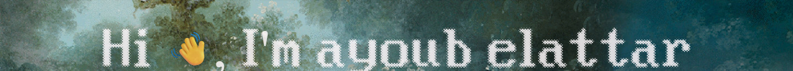 
<a href="https://elattar.dev" title="about">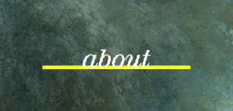</a><a href="#stack" title="stack">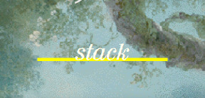</a><a href="https://github.com/ELATTAR-Ayoub?tab=repositories" title="projects">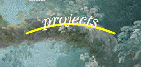</a><a href="https://elattar.dev" title="elattar.dev">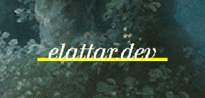</a><a href="https://elattar.dev/#contact" title="contact">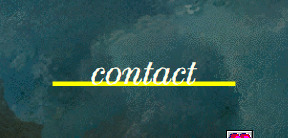</a> 
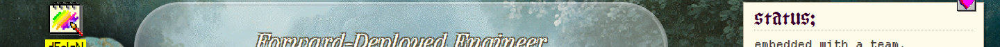 
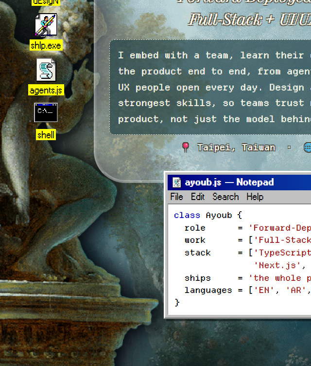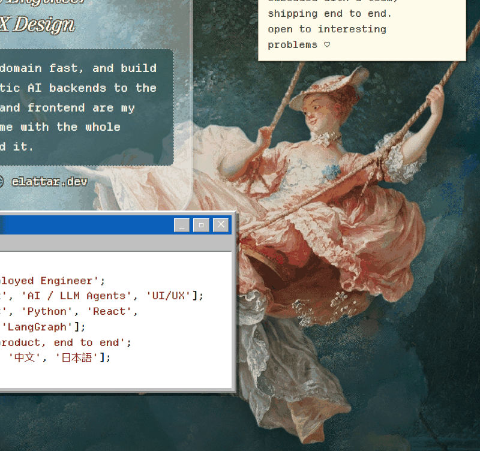 
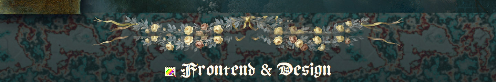 
<a href="https://developer.mozilla.org/en-US/docs/Web/JavaScript" title="JavaScript">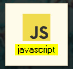</a><a href="https://www.typescriptlang.org/" title="TypeScript">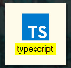</a><a href="https://react.dev/" title="React">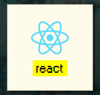</a><a href="https://nextjs.org/" title="Next.js">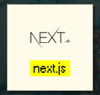</a><a href="https://vuejs.org/" title="Vue">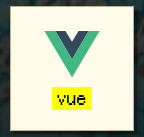</a><a href="https://nuxt.com/" title="Nuxt">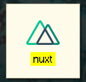</a><a href="https://flutter.dev/" title="Flutter">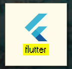</a><a href="https://sass-lang.com/" title="Sass">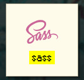</a><a href="https://tailwindcss.com/" title="Tailwind">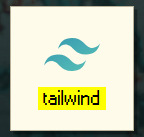</a><a href="https://www.figma.com/" title="Figma">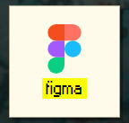</a> 
 
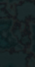<a href="https://www.python.org/" title="Python">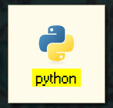</a><a href="https://nodejs.org/" title="Node.js">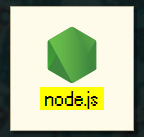</a><a href="https://www.postgresql.org/" title="PostgreSQL">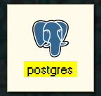</a><a href="https://graphql.org/" title="GraphQL">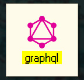</a><a href="https://www.docker.com/" title="Docker">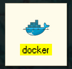</a><a href="https://firebase.google.com/" title="Firebase">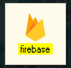</a><a href="https://www.cypress.io/" title="Cypress">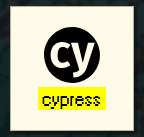</a><a href="https://git-scm.com/" title="Git">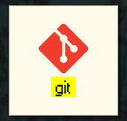</a><a href="https://www.linux.org/" title="Linux">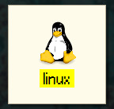</a> 
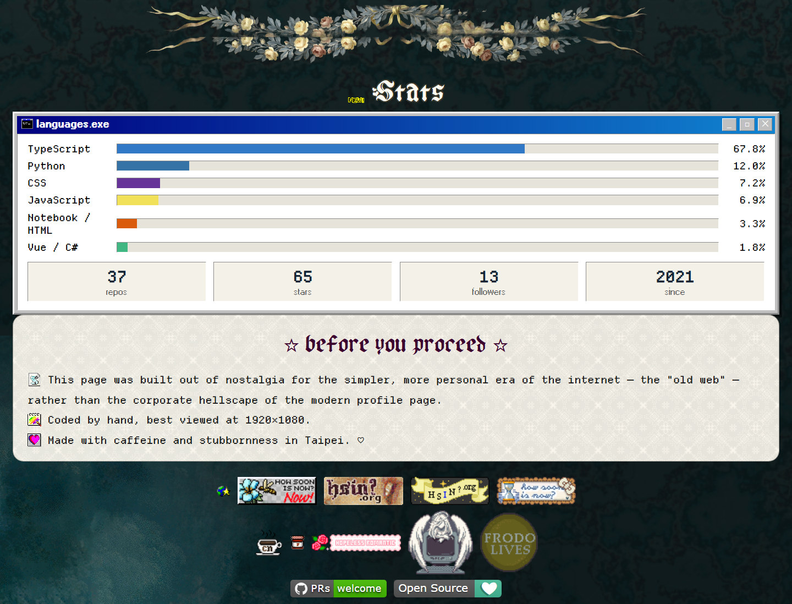 

  

